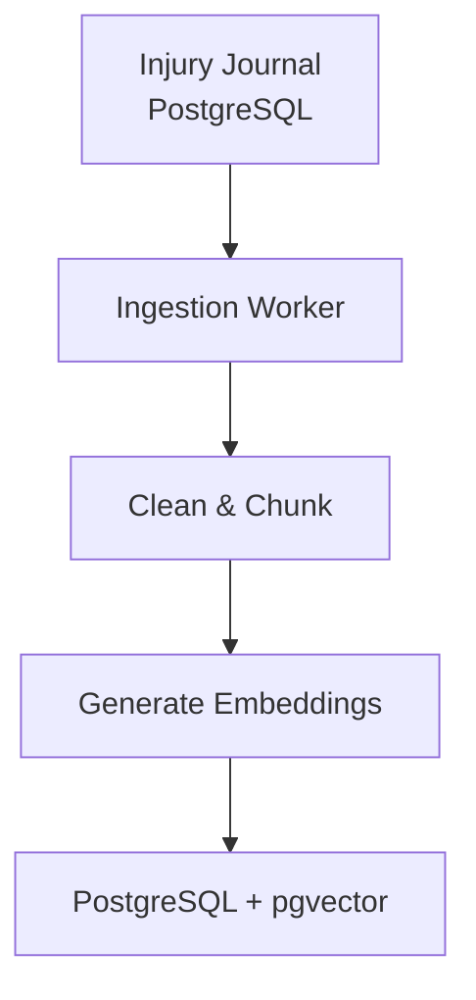

# Injury Journal AI

AI-powered injury journal assistant exploring RAG, LLMs, agent orchestration, embeddings, vector search, safety guardrails, evaluation, and AI observability.

## Project Status

The project is being built incrementally, starting with the offline ingestion pipeline and embeddings before adding semantic retrieval, RAG, agents, and production infrastructure.

## Documentation

- [Product](01-product.md) — Product goals, scope, features, and intended use.
- [Architecture](02-architecture.md) — Overall system architecture and technical design.
- [Chunker Architecture](03-chunker-architecture.md) — Detailed design of the document chunking component.
- [Implementation Roadmap](04-implementation-roadmap.md) — Step-by-step implementation plan and progress.

## Current implemented Architecture

### Offline — Ingestion & Indexing

The offline pipeline transforms structured journal records into searchable documents, chunks them, and prepares them for embedding and vector storage.

## Tech Stack

### Implemented

- TypeScript / Node.js
- PostgreSQL
- Prisma

### In Progress

- Embedding model integration

### Planned

- pgvector
- Semantic retrieval
- Retrieval-Augmented Generation (RAG)
- Citations
- Safety guardrails
- AI agents
- Evaluation
- AI observability
- Terraform
- AWS Lambda
- AWS Step Functions
- CloudWatch / DynamoDB

## Project Goal

Build a production-oriented AI assistant that can:

- Answer questions about a user's injury journal
- Retrieve relevant historical information
- Generate grounded summaries
- Cite the underlying journal records
- Apply healthcare safety boundaries
- Evaluate retrieval and answer quality
- Monitor AI workflows and operational behavior

The system is designed to be built one layer at a time, with the data and retrieval foundations established before introducing agentic workflows.
