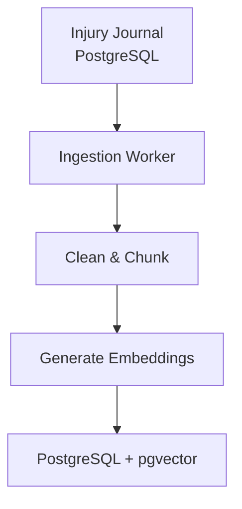
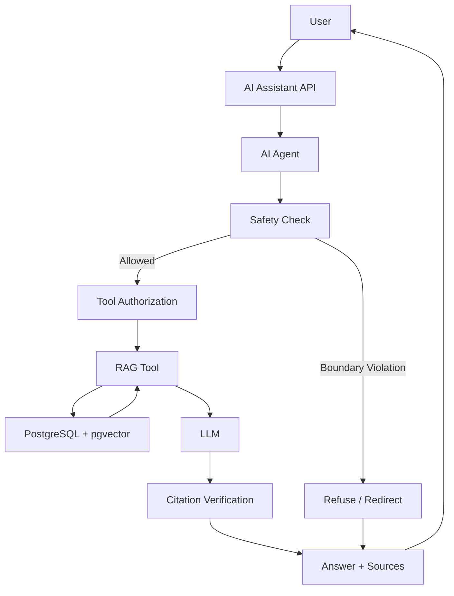
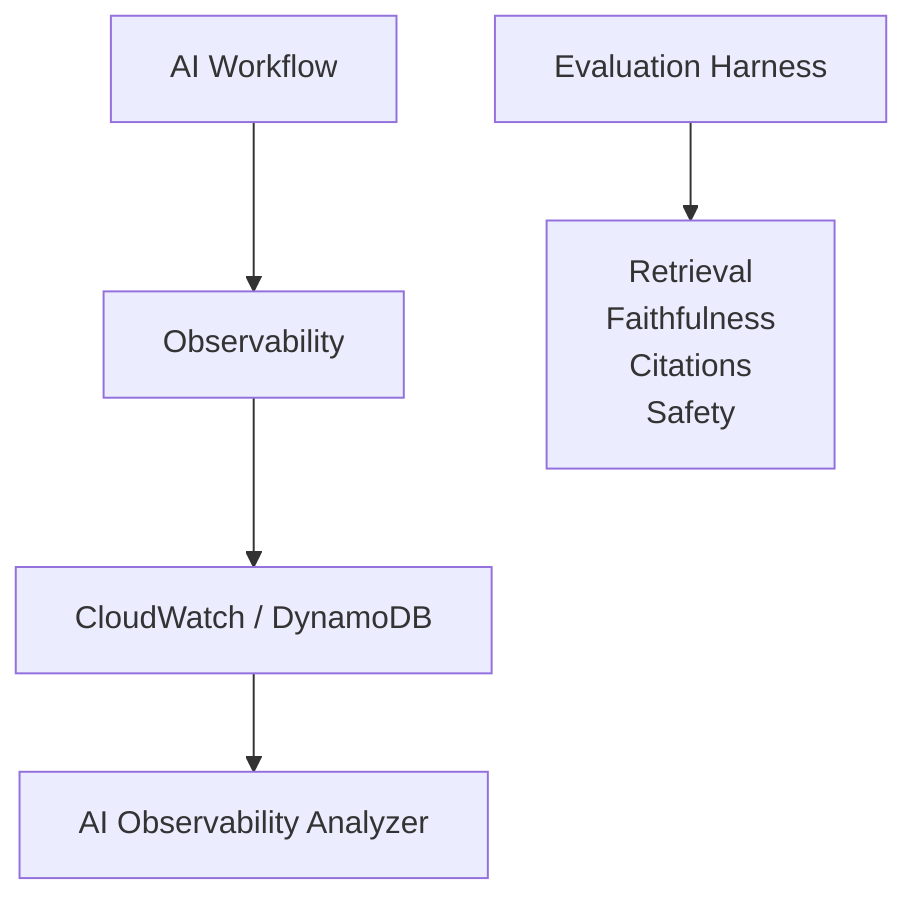

# Injury Journal AI

AI-powered injury journal assistant exploring RAG, LLMs, agent orchestration, embeddings, vector search, safety guardrails, evaluation, and AI observability.

## Architecture

### Offline — Ingestion & Indexing (WIP: Generate embeddings)

The offline pipeline prepares journal data for retrieval.

### Online — RAG & Agent Workflow (Future)

### Observability & Evaluation (Future)

## Tech Stack

### Implemented

- TypeScript / Node.js
- PostgreSQL
- Prisma
- Terraform

### Planned

- pgvector
- Embedding model
- LLM API
- RAG
- AI agents
- AWS Lambda
- AWS Step Functions
- CloudWatch / DynamoDB
