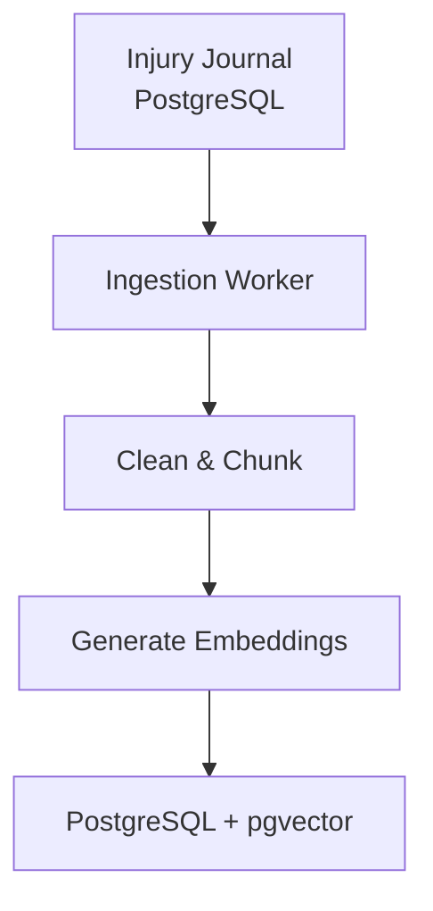
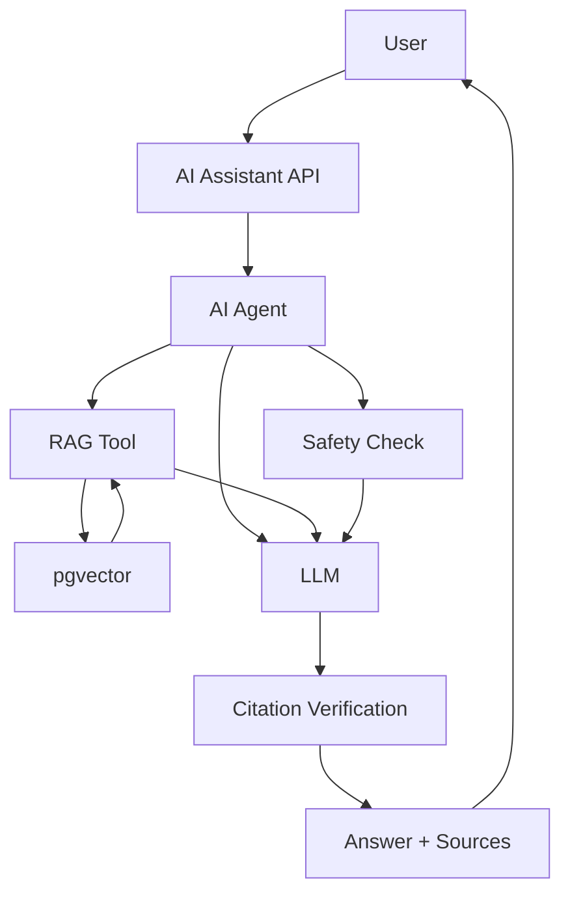
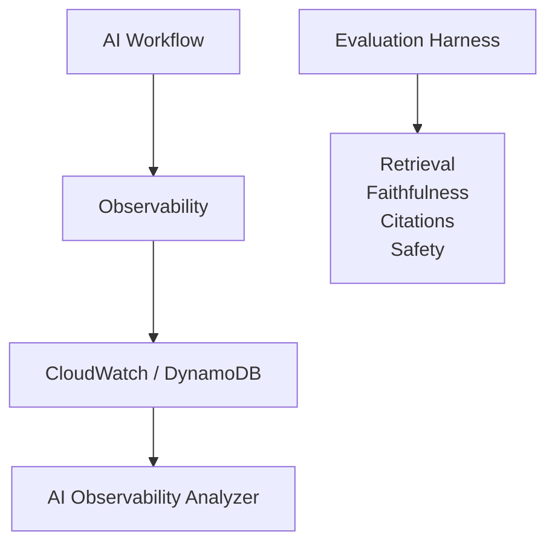

# Injury Journal AI

AI-powered injury journal assistant exploring RAG, LLMs, agent orchestration, embeddings, vector search, safety guardrails, evaluation, and AI observability.

## Architecture

### Offline — Ingestion & Indexing

The offline pipeline prepares journal data for retrieval.

### Online — RAG & Agent Workflow

### Observability & Evaluation

## Tech Stack

- TypeScript / Node.js
- PostgreSQL + pgvector
- LLM API
- Embedding models
- RAG
- AI agents
- AWS Lambda
- AWS Step Functions
- CloudWatch / DynamoDB
- Terraform
