# Injury Journal AI — Architecture

## 1. Overview

Injury Journal AI is an AI assistant built on top of an existing Injury Journal PostgreSQL application.

The system is designed to transform structured journal data into searchable AI context and use that context to generate grounded answers about the user's injury history.

The architecture is divided into two main flows:

- **Offline flow** — prepares journal data for AI retrieval by transforming records into documents, chunking them, generating embeddings, and storing the resulting vectors.
- **Online flow** — processes user questions through safety checks, authorization, retrieval, RAG, LLM generation, and citation verification.

The architecture also includes supporting systems for:

- **Evaluation** — measuring retrieval and answer quality.
- **Observability** — monitoring AI workflows and operational behavior.
- **Production infrastructure** — AWS services and infrastructure as code.
- **Security** — authentication, authorization, data isolation, and protection of journal data.

The system is intentionally built incrementally. The offline data and retrieval foundations are implemented before introducing the AI agent and production workflow.

## 2. Technology Stack

| Area            | Technology                |
| --------------- | ------------------------- |
| Language        | TypeScript                |
| Backend         | Node.js                   |
| API             | REST                      |
| Database        | PostgreSQL                |
| ORM             | Prisma                    |
| Vector Database | PostgreSQL + pgvector     |
| Embeddings      | Embedding model API       |
| LLM             | LLM API                   |
| RAG             | Custom RAG pipeline       |
| Agent           | LangGraph / state machine |
| Safety          | Application guardrails    |
| Evaluation      | Custom evaluation harness |
| Observability   | CloudWatch / DynamoDB     |
| Cloud           | AWS                       |
| Workflow        | Step Functions            |
| Compute         | Lambda                    |
| IaC             | Terraform                 |

## 3. High-Level Architecture

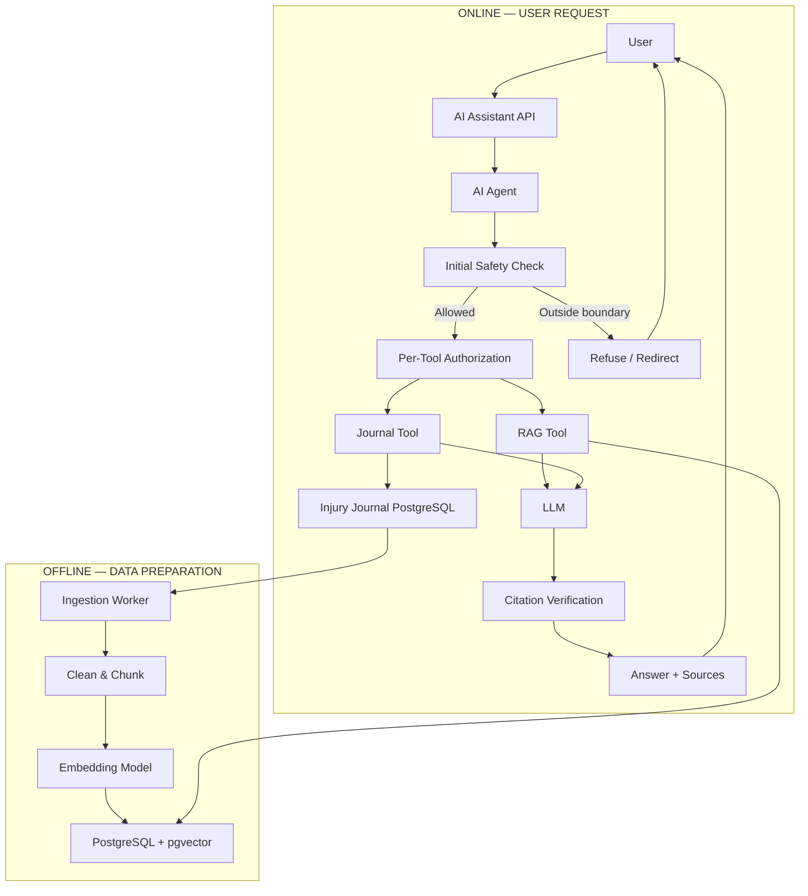

## 4. Offline Architecture

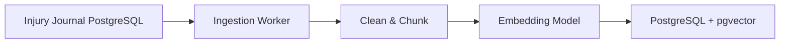

### 4.1. Offline Ingestion Pipeline

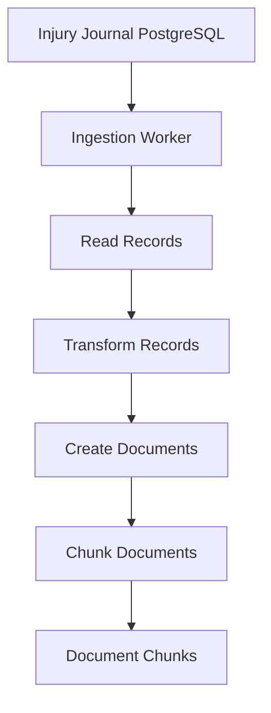

### 4.2. Embedding Architecture

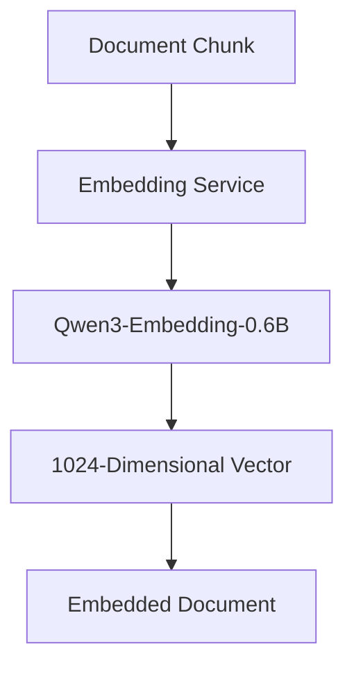

### 4.3. Vector Storage with pgvector Architecture

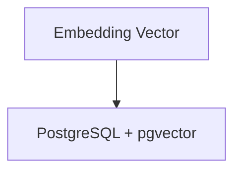

## 5. Online Architecture

### 5.1. Semantic Retrieval Architecture

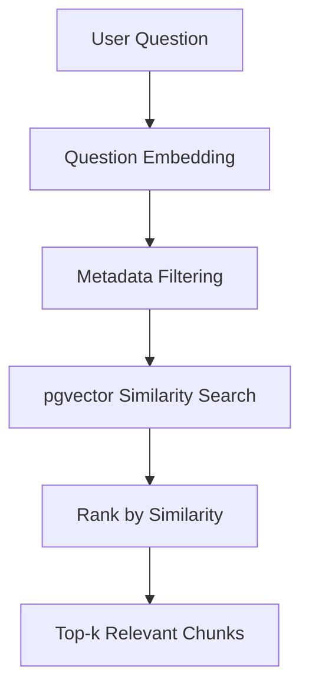

### 5.2. Basic RAG Architecture

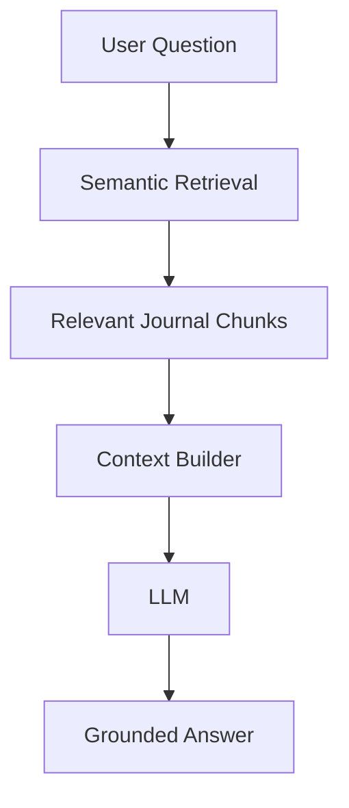

### 5.3. Citation Architecture

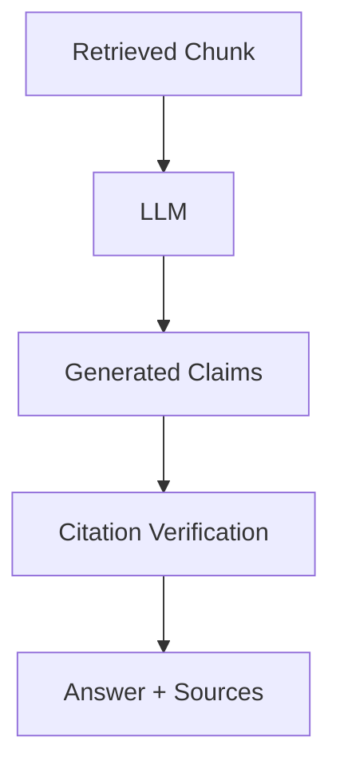

### 5.3. Safety Guardrails Architecture

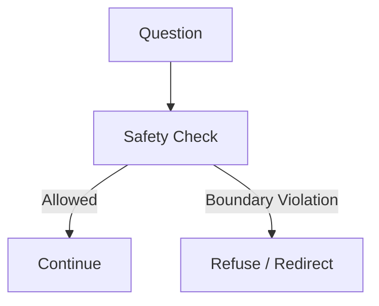

### 5.3. AI Agent Architecture

The agent decides which tools are necessary.

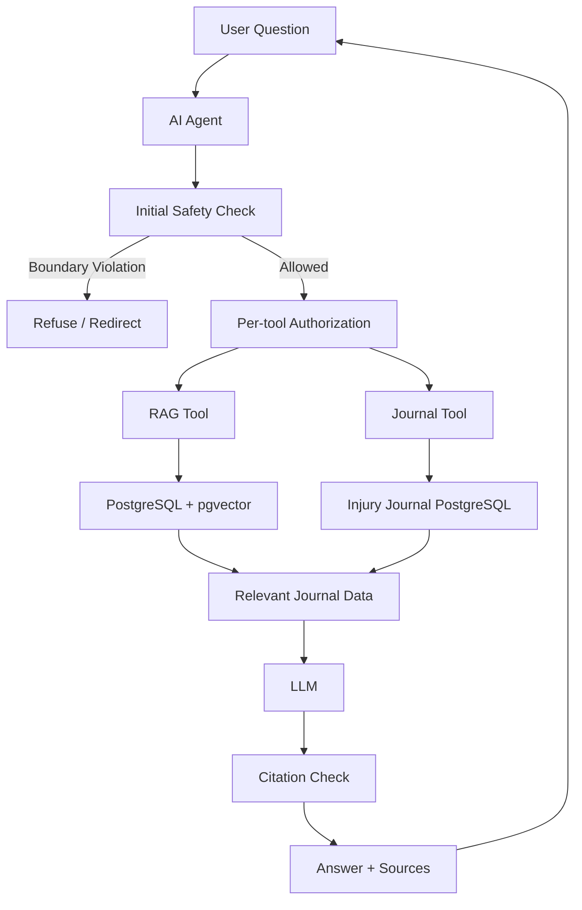

## 6. Evaluation Architecture

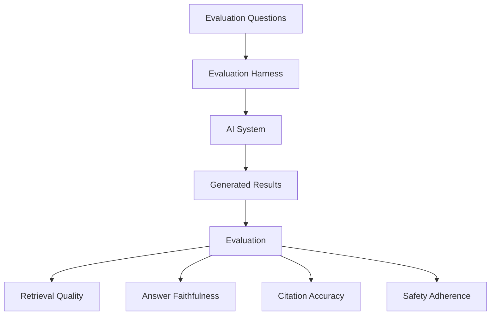

## 7. Observability Architecture

### 7.1 AI Observability

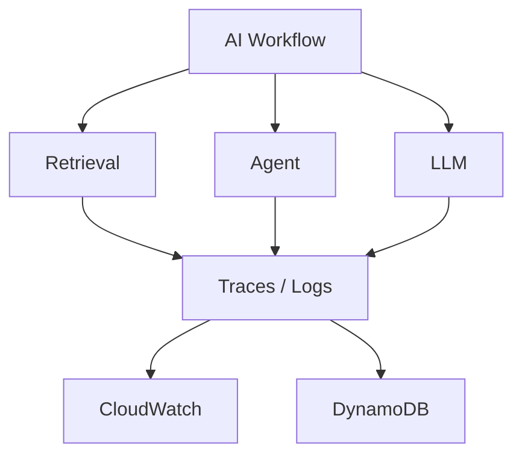

### 7.2 AI-Assisted Observability

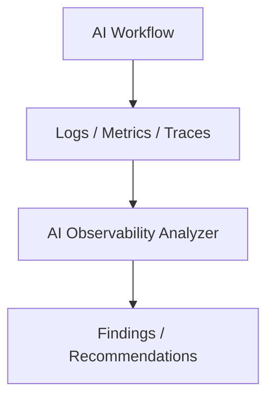

## 8. Production / AWS Architecture

### 8.1. Production Workflow

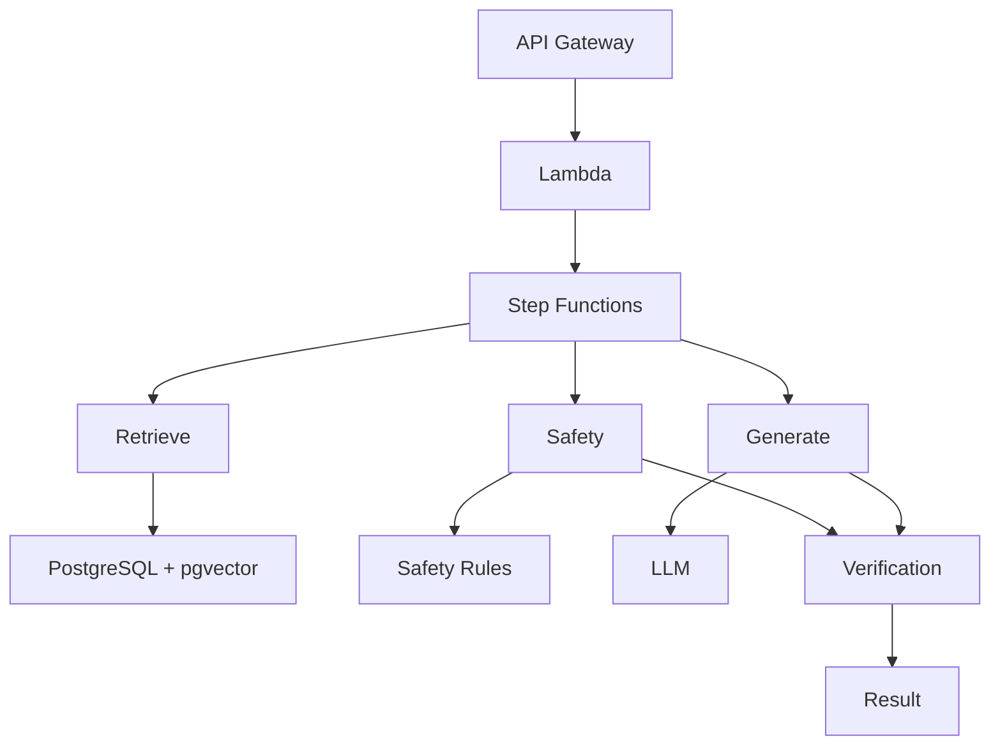

### 8.2. Workflow Reliability

Step Functions provides:

- State management
- Retries
- Timeouts
- Failure handling
- Multi-step orchestration

Side-effecting operations must be designed to be idempotent so retries do not create duplicate data or unintended effects.

## 9. Infrastructure as Code: Terraform Architecture

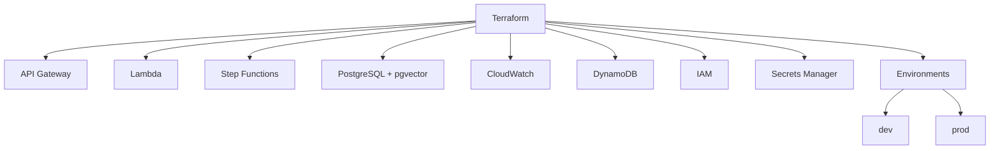

## 10. Security Architecture: Partial authorization

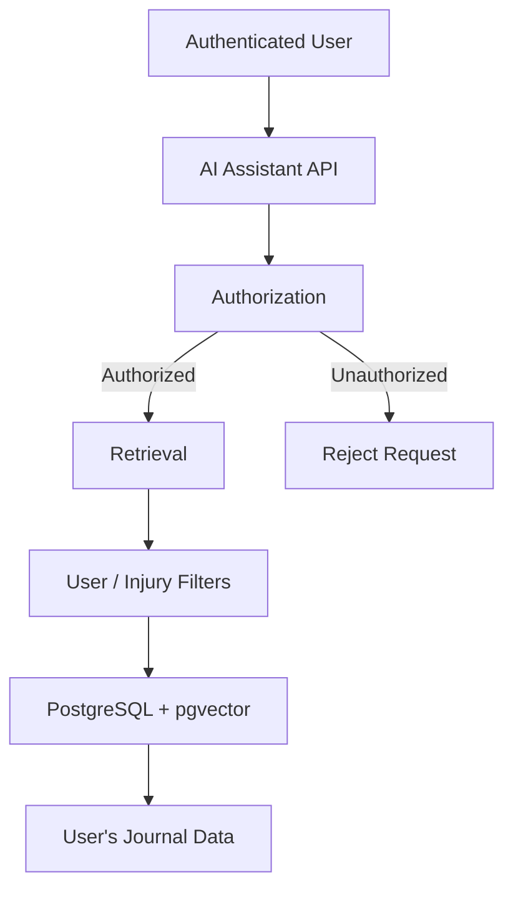
