# Injury Journal AI — Architecture

## 1. Overview

Injury Journal AI is an AI assistant built on top of an existing Injury Journal PostgreSQL application.

The system is designed to transform structured journal data into searchable AI context and use that context to generate grounded answers about the user's injury history.

The architecture is divided into two main flows:

- **Offline flow** — prepares journal data for AI retrieval by transforming records into documents, chunking them, generating embeddings, and storing the resulting vectors.
- **Online flow** — processes user questions through safety checks, authorization, retrieval, RAG, LLM generation, and citation generation.

The architecture also includes supporting systems for:

- **Evaluation** — measuring retrieval and answer quality.
- **Observability** — monitoring AI workflows and operational behavior.
- **Production infrastructure** — AWS services and infrastructure as code.
- **Security** — authentication, authorization, data isolation, and protection of journal data.

The system is intentionally built incrementally. The offline data and retrieval foundations are implemented before introducing the AI agent and production workflow.

## 2. Technology Stack

| Area            | Technology                |
| --------------- | ------------------------- |
| Language        | TypeScript                |
| Backend         | Node.js                   |
| API             | REST                      |
| Database        | PostgreSQL                |
| ORM             | Prisma                    |
| Vector Database | PostgreSQL + pgvector     |
| Embeddings      | Embedding model API       |
| LLM             | LLM API                   |
| RAG             | Custom RAG pipeline       |
| Agent (current) | Hand-written state machine (deterministic intent routing) |
| Agent (planned) | LangGraph — deferred until workflows need multi-step/dynamic tool selection |
| Safety          | Application guardrails    |
| Evaluation      | Custom evaluation harness |
| Observability   | CloudWatch / DynamoDB     |
| Cloud           | AWS                       |
| Workflow        | Step Functions            |
| Compute         | Lambda                    |
| IaC             | Terraform                 |

## 3. High-Level Architecture

> **Current status:** "Per-Tool Authorization" (`AUTH`) and "Citation Generation" (`CIT`) are
> shown here as part of the built flow. Per-tool authorization does not exist in any form yet —
> both tools run unconditionally once safety passes. Citation generation exists, but only as
> citation-building from retrieved chunks; it is not checked against the generated answer. See
> §5.5 and §10 for the current-vs-planned detail on each.

## 4. Offline Architecture

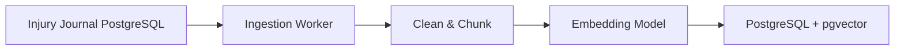

### 4.1. Offline Ingestion Pipeline

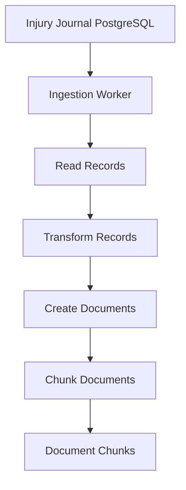

> **Current status:** every stage below "Ingestion Worker" is implemented and unit/integration
> tested (`postgres-reader.ts`, `document-builder.ts`, `document-chunker.ts`,
> `embed-and-store.ts`). The "Ingestion Worker" node itself — something that actually calls these
> stages in sequence on a schedule, webhook, or CLI trigger — does not exist yet. Today the only
> place all stages run together is inside test files; there is no runnable entrypoint that
> populates `DocumentChunk` in a live system.

### 4.2. Embedding Architecture

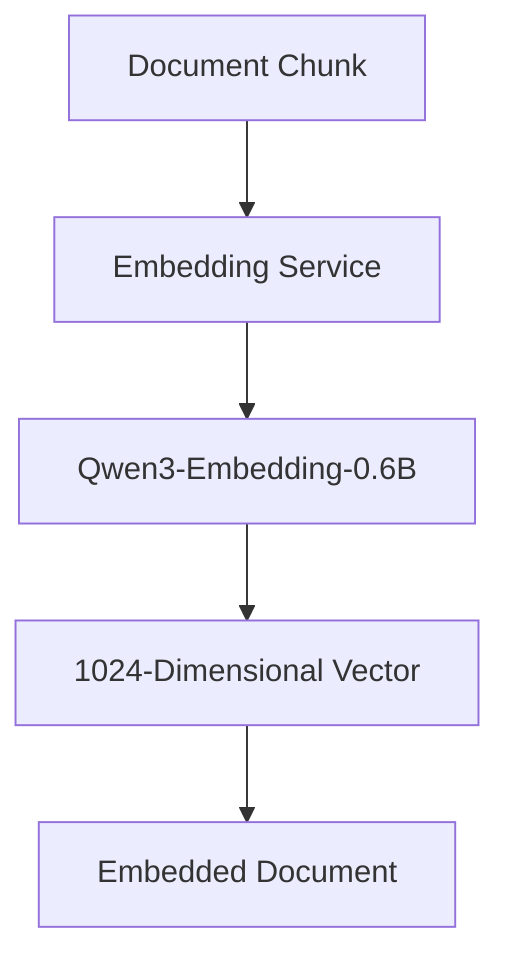

> **Real design gap (not just a documentation-vs-code mismatch):** Qwen3-Embedding-0.6B is
> designed for *asymmetric* retrieval — documents and queries should be embedded differently
> (queries use an instruction-style prompt, documents don't) for best retrieval quality. The
> embedding service already implements both (`embed_document()` and `embed_query()` in
> `embedding_service.py`), but the API layer only ever exposes the document-side call, and the
> retrieval path (`semantic-search.ts`) embeds the user's question through that same
> document-side endpoint. This isn't a deferred feature — it's a built capability that's
> disconnected, quietly costing retrieval quality today. Recommended fix: add a query-mode
> endpoint (or a `mode` field) to the embedding API and call it from the query path. See
> `docs/handoff/architecture-review.md` §6 (Decision D3) and
> `docs/04-implementation-roadmap.md`'s "do now" list.

### 4.3. Vector Storage with pgvector Architecture

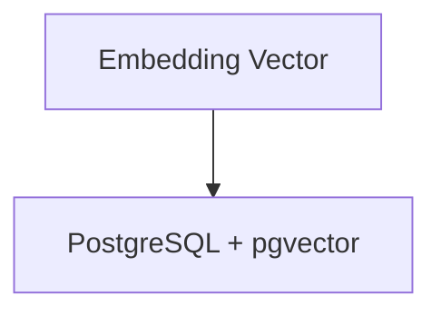

> **Implemented beyond this diagram:** storage is idempotent — writes use
> `INSERT ... ON CONFLICT (sourceType, sourceId, chunkIndex) DO UPDATE`, and re-ingesting a
> record that now produces fewer chunks prunes the stale ones (`deleteDocumentChunksExcept`).
> Concurrent ingestion of the same source record is serialized by an in-process lock
> (`ingestion-lock.ts`). This machinery is real, tested, and working, but isn't shown here.

## 5. Online Architecture

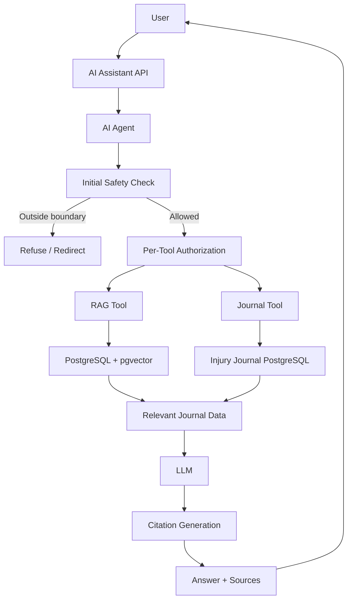

> Same caveat as §3: `AUTH` ("Per-Tool Authorization") is not implemented. See §5.5.

### 5.1. Semantic Retrieval Architecture

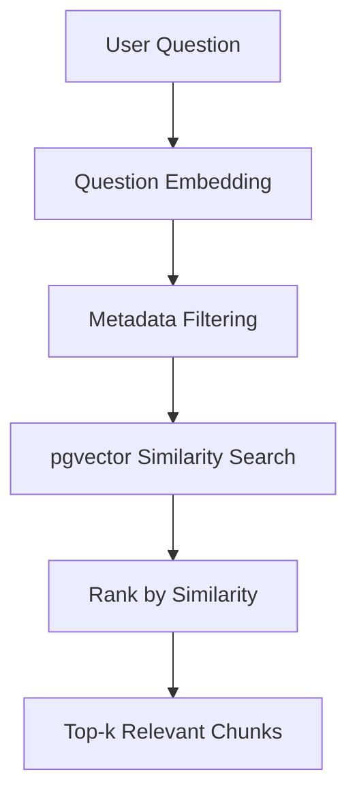

> **Current status:** "Question Embedding" uses the document-side embedding call, not a
> query-specific one — see §4.2's design-gap note, which applies here at the point of use.
> "Metadata Filtering" is `injuryId` only; `userId`, `sourceType`, and date-range filters are not
> implemented (deliberately deferred pending evaluation data, per issue #35). There is no
> similarity threshold — "Top-k Relevant Chunks" really means "Top-k *Nearest* Chunks," which may
> not be relevant at all if the journal has little or no ingested content for the question asked.

### 5.2. Basic RAG Architecture

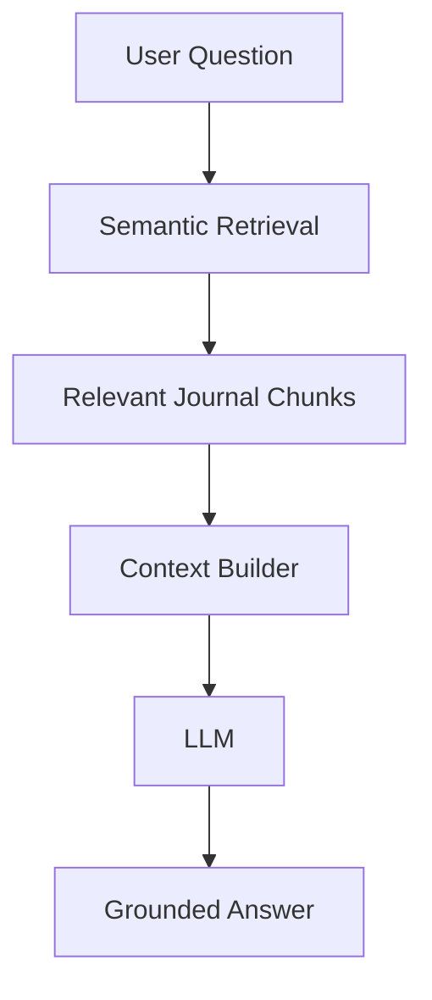

### 5.3. Citation Architecture

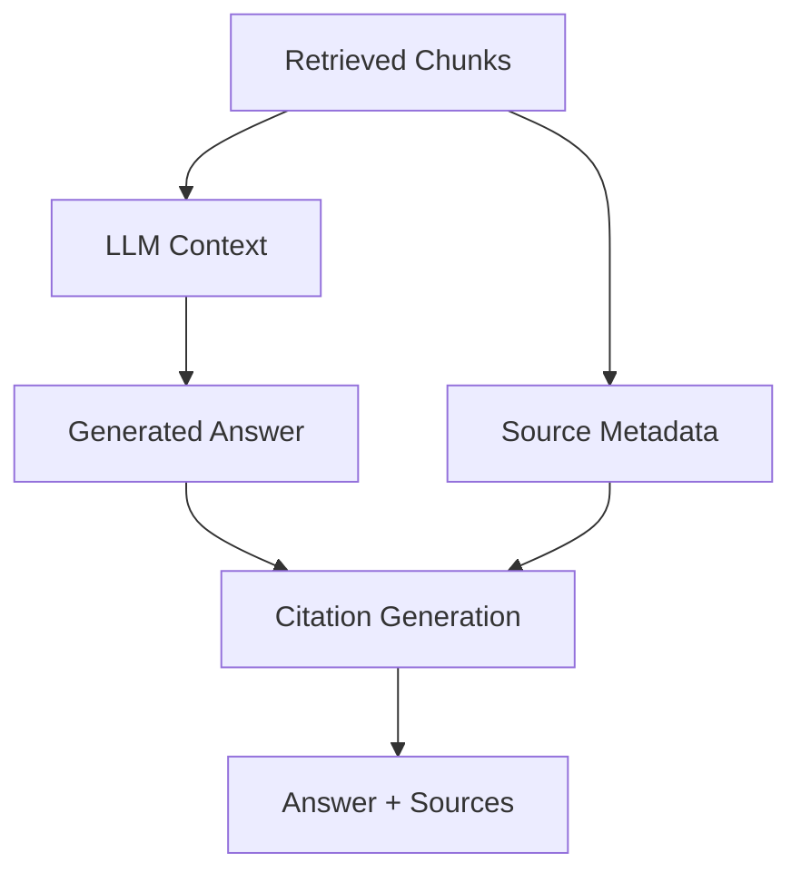

> **Current status:** only "Citation Generation" from retrieved-chunk metadata is live
> (`citation-builder.ts`) — it does not consult the generated answer (`A` in this diagram feeds
> `V` conceptually, but no code path actually inspects the LLM's output when building citations).
> Three additional modules exist for source verification and formatting
> (`citation-verifier.ts`, `citation-source-mapper.ts`, `citation-formatter.ts`) but are not
> wired into any response path yet — they represent planned work, not alternate current
> behavior. Today's citations are a provenance list of what was retrieved, not a fact-checked
> bibliography of what the answer actually used.

### 5.4. Safety Guardrails Architecture

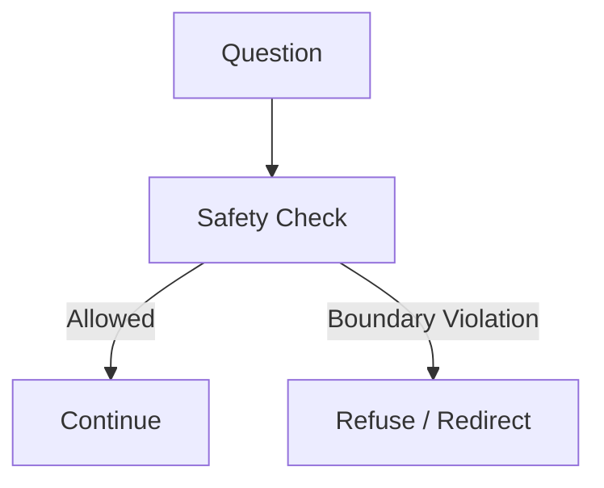

> **Current status:** this covers the input side only. There is no output-side check — nothing
> verifies the LLM's generated answer against diagnosis-adjacent language it might echo from raw
> journal content (e.g. a doctor's note). Output safety checks are future work.

### 5.5. AI Agent Architecture

The agent decides which tools are necessary.

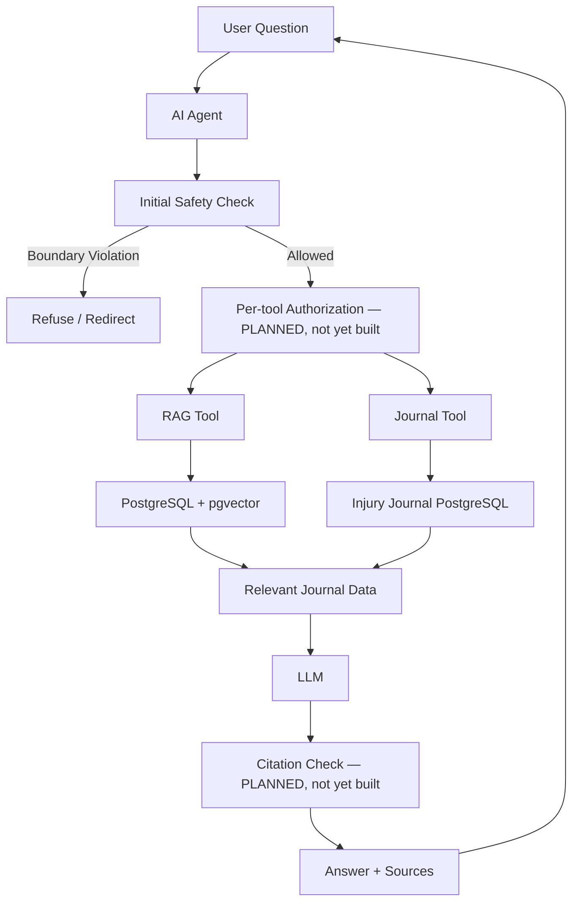

> **Current status vs. this diagram:**
> - "Per-tool Authorization" does not exist in any form — both tools execute unconditionally once
>   the initial safety check passes. This is the concrete scope of the open security work (see
>   `docs/04-implementation-roadmap.md`).
> - "Citation Check" does not exist — citations are built from retrieved chunks only (§5.3), with
>   no verification against what the LLM actually generated.
> - Tool selection ("the agent decides which tools are necessary") is currently fixed-keyword
>   matching on the question text, not model-driven decision-making — an intentional MVP
>   simplification, deferred until multi-step workflows justify an LLM planner or LangGraph.
> - The RAG Tool and Journal Tool are not symmetric today: the RAG path runs the full
>   retrieval → LLM → citation pipeline shown above; the Journal Tool path returns the raw
>   database record with no LLM synthesis and no citations. This is an unfinished placeholder,
>   not a deliberate design choice.

## 6. Evaluation Architecture

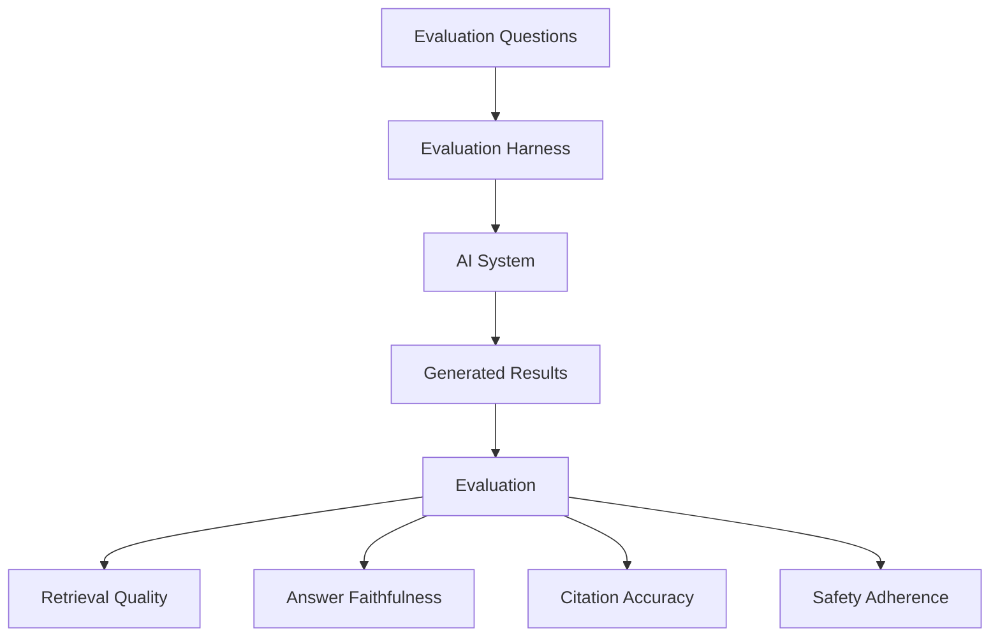

> **Current status:** the harness and "Retrieval Quality" scoring are implemented. "Citation
> Accuracy" and "Safety Adherence" are implemented but shallow (they check for the presence of an
> expected signal, not its correctness). "Answer Faithfulness" is not implemented at all — no
> metric exists for it today. The evaluation dataset also currently has only 4 cases total. See
> `docs/handoff/step3-architecture-diff.md` §6.

## 7. Observability Architecture

### 7.1 AI Observability

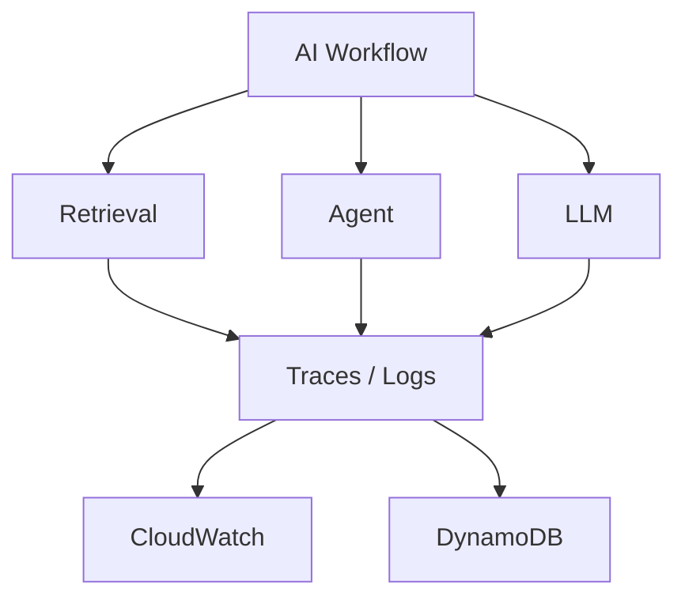

### 7.2 AI-Assisted Observability

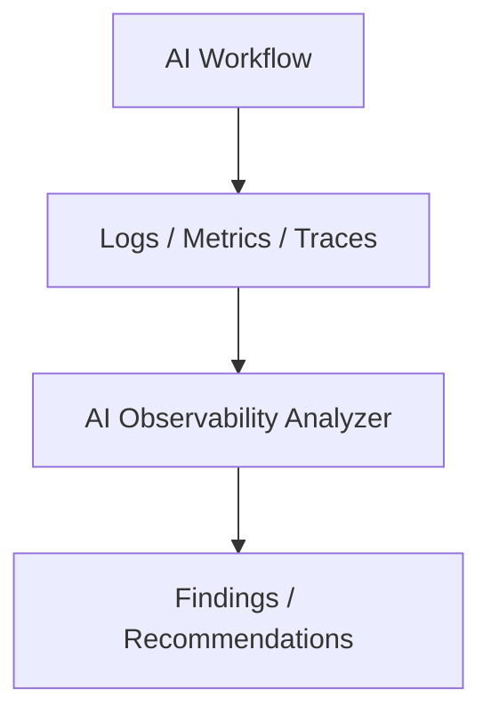

> §7 as a whole is not implemented yet (roadmap Step 6). One recommendation carried over from
> `docs/handoff/architecture-review.md` §15: thread a request ID through the pipeline now, even
> as a no-op passed-through parameter, rather than retrofitting it into every function signature
> once this step starts — none of the current pipeline stages carry one today.

## 8. Production / AWS Architecture

### 8.1. Production Workflow

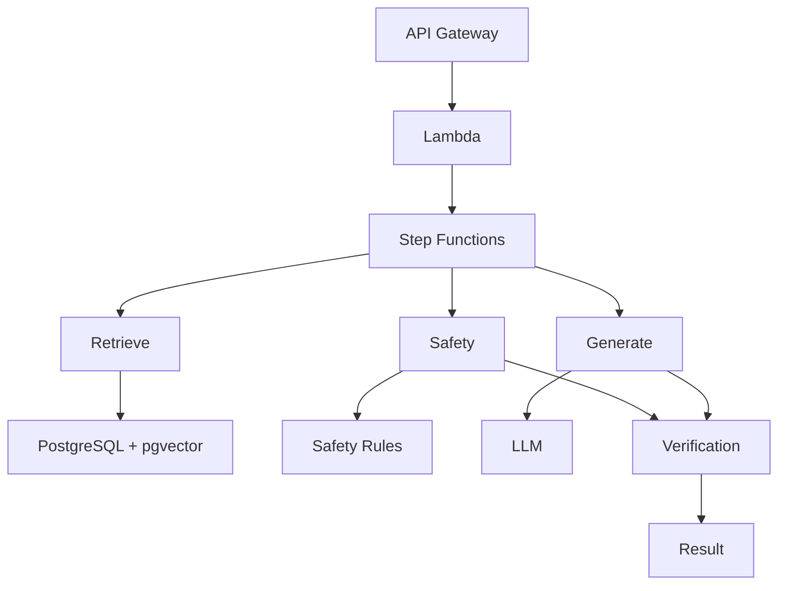

### 8.2. Workflow Reliability

Step Functions provides:

- State management
- Retries
- Timeouts
- Failure handling
- Multi-step orchestration

Side-effecting operations must be designed to be idempotent so retries do not create duplicate data or unintended effects.

> Note: the offline ingestion path already meets this bar today (see §4.3) — that work does not
> need to be redone when this step starts, only re-platformed.

## 9. Infrastructure as Code: Terraform Architecture

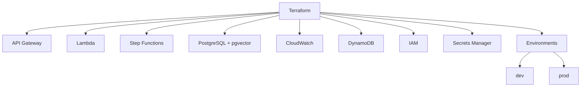

> Not implemented yet (roadmap Step 8). One architectural note worth deciding early, from
> `docs/handoff/architecture-review.md` §16: the embedding service is a separate Python process
> with a heavier runtime footprint (a loaded transformer model) than anything else in the stack —
> decide whether it stays a long-lived service, a sidecar, or a batch/Lambda-friendly on-demand
> load before this Terraform work starts, since those have very different cost/latency profiles.

## 10. Security Architecture: Target authorization design (not yet built)

> **Current status: none of this exists yet — not partially.** Every request today is anonymous
> server-side; there is no authentication, no authorization step, and no enforced user/injury
> filter anywhere in the request path. Any caller can supply any `injuryId` and receive that
> injury's data. This diagram describes the target design for the open security work, not
> current behavior — see `docs/04-implementation-roadmap.md` Step 5.
>
> Closing this gap also requires a schema change, not just a middleware: `DocumentChunk` has no
> real `userId` column today (it only exists inside an unindexed JSON metadata blob), so the
> "User / Injury Filters" step below cannot be implemented against vector search results until
> that column is added.

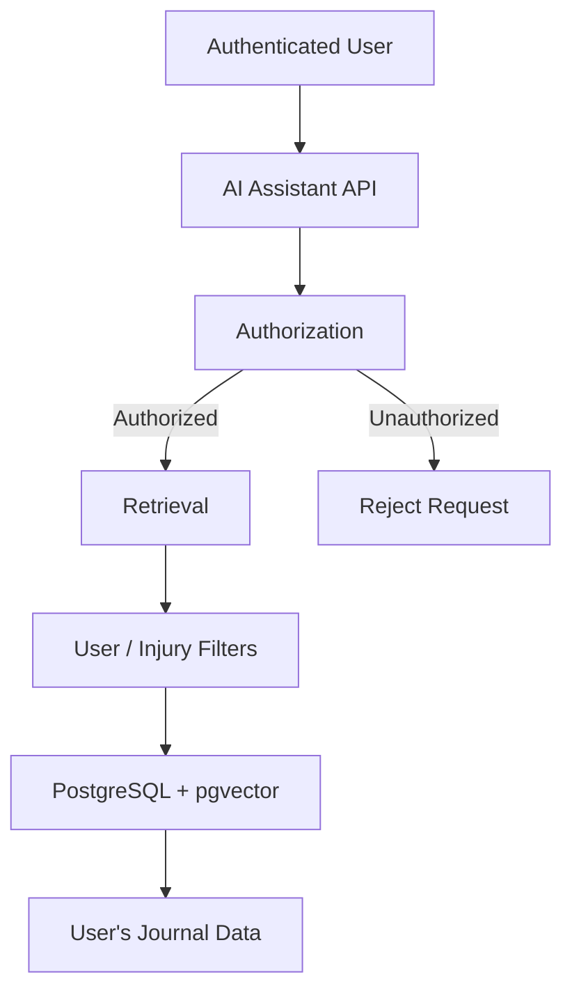
