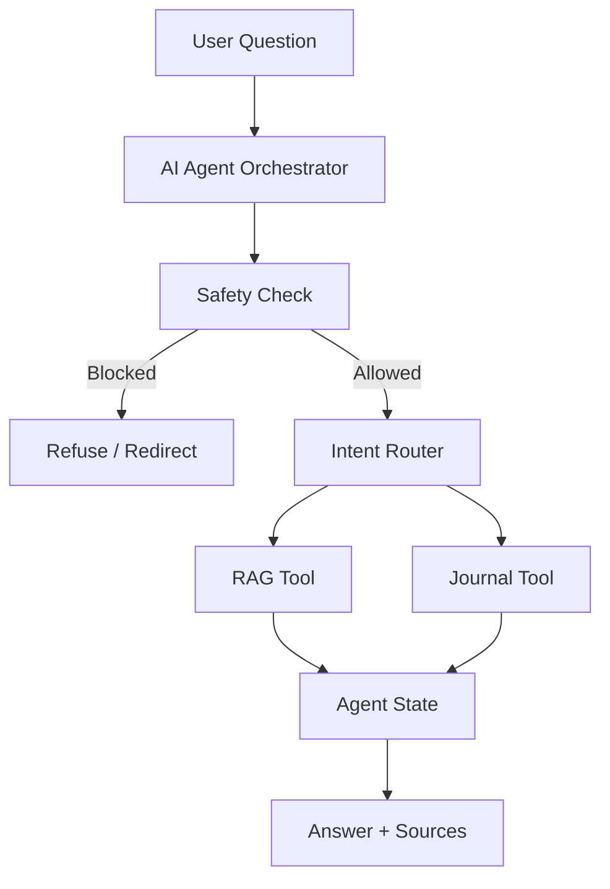
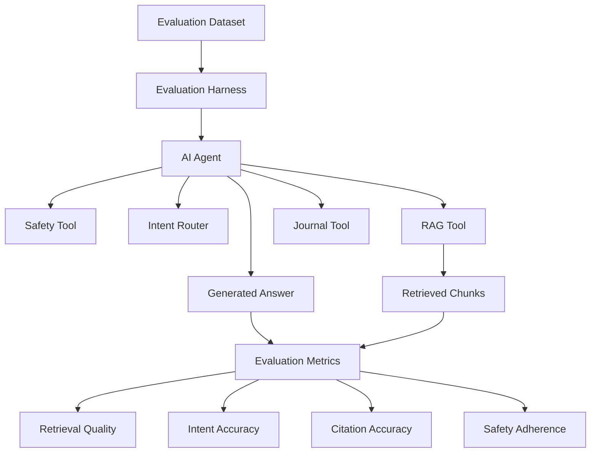

# Injury Journal AI — Implementation Roadmap

A step-by-step plan for building a production-oriented AI assistant on top of the existing Injury Journal PostgreSQL application.

The system is built incrementally, with each step adding a new capability to the architecture.

---

## Implementation Checklist

Use this checklist to track implementation progress.
Click a step to jump directly to its section.

- [x] [Step 0 — Project Foundation](#step-0--project-foundation)
- [x] [Step 1 — Offline Ingestion Pipeline](#step-1--offline-ingestion-pipeline)
- [x] [Step 2 — Embeddings](#step-2--embeddings)
- [x] [Step 3 — Vector Storage with pgvector](#step-3--vector-storage-with-pgvector)
- [x] [Step 4 — Semantic Retrieval](#step-4--semantic-retrieval)
- [x] [Step 5 — Basic RAG](#step-5--basic-rag)
- [x] [Step 6 — Citations](#step-6--citations)
- [x] [Step 7 — Safety Guardrails](#step-7--safety-guardrails)
- [x] [Step 8 — AI Agent](#step-8--ai-agent)
- [x] [Step 9 — Evaluation](#step-9--evaluation)
- [ ] [Step 10 — AI Observability](#step-10--ai-observability)
- [ ] [Step 11 — AI-Assisted Observability](#step-11--ai-assisted-observability)
- [ ] [Step 12 — Production Workflow with AWS](#step-12--production-workflow-with-aws)
- [ ] [Step 13 — Infrastructure as Code](#step-13--infrastructure-as-code)
- [ ] [Step 14 — Security and Production Hardening](#step-14--security-and-production-hardening)

---

## Implementation Principles

- Build the system incrementally, completing each foundation before building on top of it.
- Establish the data, embeddings, vector storage, retrieval, and RAG foundations before building the AI agent.
- Keep the architecture aligned with the capabilities implemented at each step.

---

# Step 0 — Project Foundation

**Goal:** Set up the AI project independently from the existing Injury Journal application.

## Implement

- TypeScript
- ESLint / Prettier
- Environment variables
- Project structure
- Prisma database connection
- PostgreSQL connection
- README and documentation

## Result

The AI project can safely read data from the existing Injury Journal database.

---

# Step 1 — Offline Ingestion Pipeline

**Goal:** Transform structured journal records into AI-searchable documents.

Existing data:

- Injury
- Symptom
- Treatment
- MedicalVisit
- TimelineEvent

## Implement

Build:

- PostgreSQL reader
- Document builder
- Chunker
- Ingestion worker

## Example

```text
Treatment
  ↓
"On June 1, 2026, the user received
physiotherapy from Clinic A.
The reported outcome was no improvement."
```

## Result

The database data has been transformed into text suitable for AI processing.

---

# Step 2 — Embeddings

**Goal:** Convert journal chunks into vector representations.

## Implement

- Embedding service
- Embedding model integration
- Batch embedding
- Embedding storage format

## Embedding Versioning

When embeddings are stored, record:

- embedding model
- model version
- vector dimension
- embedding version/compatibility key

If the embedding model or vector dimension changes, existing documents must be re-embedded before using the new embedding configuration.
Each chunk receives an embedding representing its semantic meaning.

## Result

Journal text can now be represented mathematically for semantic search.

---

# Step 3 — Vector Storage with pgvector

**Goal:** Store embeddings and make them searchable.

Use:

**PostgreSQL + pgvector**

## Implement

Create RAG-specific storage containing:

```text
DocumentChunk

id
injuryId
sourceType
sourceId
content
embedding
metadata
createdAt
```

Metadata should allow the system to trace a chunk back to its original journal record.

## Result

The project now has a vector database for semantic retrieval.

---

# Step 4 — Semantic Retrieval

**Goal:** Build the retrieval component of RAG.

## Example:

> What treatments didn't work?

## Implement

- Query embedding
- pgvector similarity search
- Top-k retrieval
- Metadata filtering (possible filters: User, Injury, Source type, Date range)
- Retrieval service

## Result

The system can find relevant journal information based on meaning rather than exact keywords.

---

# Step 5 — Basic RAG

**Goal:** Combine semantic retrieval with an LLM to generate grounded answers from the user's injury journal.

Without RAG:

```text
Question → LLM → Answer
```

With RAG:

```text
Question → Semantic Retrieval → Relevant Journal Chunks → Context Construction → Prompt Construction → LLM → Grounded Answer
```

## Implement

- Context builder
- Prompt builder
- LLM service
- RAG orchestration service
- RAG controller
- RAG API endpoint

## Result

This is the project's **first complete AI application**.

---

# Step 6 — Citations

**Goal:** Make generated answers traceable to the original journal records.

## Implement

Store source metadata with every chunk:

```text
userId
injuryId
sourceType
sourceId
date
```

Build:

- Citation generation from retrieved chunks
- Citation mapper
- Citation formatting
- Source mapping
- Source-level citation Generation
- Citation metadata preservation

(Optional later):

- Claim-level citation verification

## Example:

```text
The user tried physiotherapy in June 2026
with no reported improvement.

Sources:
- Treatment #42 — June 2026
```

## Result

The RAG system becomes source-backed and more resistant to unsupported claims.

---

# Step 7 — Safety Guardrails

**Goal:** Keep the assistant within safe boundaries.

The system organizes and summarizes the user's information. It does not diagnose medical conditions.

## Implement

- Safety rules
- Input boundary checks
- Safe refusal responses
- Optional output checks

## Example:

```text
"Summarize my treatments."
→ Allowed

"Do I have cancer?"
→ Boundary violation
```

## Result

The AI application has explicit healthcare safety boundaries.

---

# Step 8 — AI Agent

**Goal:** Add agentic orchestration after RAG and safety foundations work.

Do **not** build the agent before the underlying tools exist.

## Implement

Create tools such as:

- RAG tool (wrap existing RAG service)
- Journal/database tool (query structured injury data)
- Safety tool (wrap existing safety service)
- Citation tool (wrap existing citation generation)

Start with a hand-written orchestration layer.
Introduce LangGraph or another framework only when workflows become more complex.

## Current MVP Agent Architecture

The MVP uses deterministic orchestration.

The agent flow is:



## Result

The project now demonstrates **agentic AI**, rather than simply calling an LLM.

---

# Step 9 — Evaluation

**Goal:** Measure whether the AI system actually works.

## Implement

Create an evaluation dataset containing:

- Representative questions
- Expected behavior
- Expected sources
- Safety/adversarial questions

Evaluate:

- Retrieval quality
- Answer faithfulness
- Citation accuracy
- Safety adherence

## Evaluation implementation details



## Result

You can measure changes to the AI system instead of relying only on manually testing it.

---

# Step 10 — AI Observability

**Goal:** Understand what happens during every AI request.

## Implement

Track:

- Request ID
- Agent step
- Retrieval latency
- Retrieved chunk identifiers and metadata, not raw journal content
- Similarity scores
- LLM calls
- Token usage
- Errors
- Cost
- Final result metadata, not raw journal content

## Safe Logging

- Do not log raw journal content by default.
- Do not log retrieved chunks or final results as raw content by default.
- Prefer identifiers and metadata over content.
- Redact sensitive information when content must be logged.
- Encrypt telemetry in transit and at rest.
- Restrict access to telemetry through appropriate access controls.
- Define and enforce a retention and deletion policy.

## Result

You can see **how** the AI reached an answer and where failures occur.

---

# Step 11 — AI-Assisted Observability

**Goal:** Use AI to analyze the AI system's own telemetry.

This is an additional AI layer, not basic observability.

## Example questions

```text
Why are retrieval scores dropping?

Which prompts frequently fail?

Which answers have citation problems?

Which agent steps are slow?

Which requests repeatedly trigger safety boundaries?
```

## Result

The system can use AI to help analyze its own operational behavior.

---

# Step 12 — Production Workflow with AWS

**Goal:** Move the multi-step agent workflow toward a production architecture.

## Implement

Use:

- API Gateway
- Lambda
- Step Functions

## Idempotency & Retries

Define retry behavior for each side-effecting workflow step.

- Use stable idempotency keys for ingestion runs and persisted records.
- Make chunk persistence idempotent so retries do not create duplicate chunks.
- Make embedding/LLM operations retry-safe where possible.
- Define checkpoints or workflow state so completed steps do not unnecessarily run again.
- Document which steps are safe to retry and which steps require deduplication.

## Result

The agent workflow becomes more reliable and production-oriented.

---

# Step 13 — Infrastructure as Code

**Goal:** Make the infrastructure reproducible.

## Implement

Use Terraform for:

- API Gateway
- Lambda
- Step Functions
- PostgreSQL / pgvector
- CloudWatch
- DynamoDB
- IAM
- Secrets Manager

Create separate environments where appropriate:

```text
dev
prod
```

## Result

The infrastructure can be recreated consistently rather than configured manually.

---

# Step 14 — Security and Production Hardening

**Goal:** Protect personal journal information.

## Implement

- Authentication
- Authorization
- User-level data isolation
- Input validation
- Secret management
- Least-privilege IAM
- Secure API endpoints
- Safe logging
- Vector-level authorization
- Retrieval authorization checks
- Regression tests for data isolation boundaries

Critical rule:

```text
    User A
      ↓
    Can only retrieve
      ↓
    User A's journal data
```

The RAG system must never expose another user's information.

## Future improvements

- Integrate citation source verification into the RAG response pipeline
- Verify that cited journal records still exist
- Verify citation ownership before exposing sources
- Add claim-level citation verification

Security applies across:

- Database queries
- Journal tools
- RAG retrieval
- Vector similarity search
- AI agent tool execution

Example security flow:

```text
    User Request
          ↓
    Authentication
          ↓
    Authorization
          ↓
    Retrieve only authorized injury data
          ↓
    RAG / Agent processing
          ↓
    Answer
```

## Result

Security applies across both the normal database and AI retrieval layers.

# Step 15 — Future improvements

## Future Embedding Model Management

The current MVP uses a fixed embedding dimension:

- Model: Qwen3-Embedding-0.6B
- Dimension: 1024
- Storage: pgvector `vector(1024)`

This is intentional because the MVP uses a single embedding model.

Future improvements:

- Track embedding model metadata
- Support embedding model versioning
- Store embedding generation configuration
- Support migrations when changing embedding dimensions
- Re-index existing documents when switching embedding models
- Evaluate retrieval quality across different embedding models

Possible future design:

DocumentChunk
|
+-- Embedding
|
+-- model name
+-- dimension
+-- version
+-- generated timestamp

## Future Retrieval Improvements

The current MVP uses top-k vector similarity search.

The retrieval pipeline is intentionally kept simple to establish a baseline before introducing more advanced retrieval techniques.

Current approach:

```text
User Question
      |
      v
Question Embedding
      |
      v
pgvector Similarity Search
      |
      v
Top-k Retrieved Chunks
      |
      v
LLM Generation
```

### Similarity Thresholds

The current system always returns the top-k closest chunks, even when the retrieved chunks may not be strongly relevant.

Future improvements:

- Add configurable similarity thresholds
- Handle cases where no sufficiently relevant context is found
- Tune retrieval thresholds using evaluation results

Similarity thresholds should be introduced after measuring retrieval quality rather than choosing values arbitrarily.

Future flow:

```text
User Question
      |
      v
Vector Search
      |
      v
Similarity Threshold Check
      |
      v
Relevant Chunks Only
      |
      v
LLM Generation
```

### Reranking

The current MVP relies only on embedding similarity to rank retrieved chunks.

Future improvement:

Introduce a reranking step after initial vector retrieval to improve the quality of retrieved context.

Future flow:

```text
User Question
      |
      v
Embedding Retrieval
      |
      v
Reranker
      |
      v
Top-k Highest Quality Chunks
      |
      v
LLM Generation
```

Potential improvements:

- Add a reranking model after vector retrieval
- Compare retrieval quality before and after reranking
- Evaluate impact on answer faithfulness and citation accuracy
- Tune the number of candidates retrieved before reranking

Reranking should be introduced only after evaluating the baseline retrieval system and identifying retrieval quality limitations.

## Future API Improvements

- Add schema-based request validation (for example Zod) as the API surface grows
- Standardize API error responses
- Add stricter input validation across all endpoints

## Offline Ingestion Pipeline

- [x] Document chunking
- [x] Generate embeddings
- [x] Store embeddings in pgvector
- [x] Make document-chunk ingestion idempotent
- [x] Serialize ingestion per `(sourceType, sourceId)` to prevent concurrent prune races
- [ ] Add distributed ingestion locking/versioning for production deployments

### Ingestion Concurrency

The current implementation uses an in-process lock keyed by
`(sourceType, sourceId)`. This prevents overlapping ingestions for the same
source from racing during stale-chunk cleanup.

This is sufficient for the current single-process development architecture.
For production deployments with multiple workers, containers, or Lambda
instances, replace or supplement this with distributed coordination such as
PostgreSQL advisory locks or source revision/versioning.

Database transactions should not remain open while waiting for embedding API
requests.

## Semantic Retrieval

### Current Implementation:

- Embed the user's question using the embedding service
- Search `DocumentChunk` using pgvector cosine distance
- Rank results by vector similarity
- Retrieve configurable top-k results
- Filter retrieval by `injuryId`
- Unit tests for the semantic retrieval service
- Integration tests for pgvector similarity search

Current retrieval flow:

User Question
→ Question Embedding
→ Metadata Filtering
→ pgvector Similarity Search
→ Similarity Ranking
→ Top-k Relevant Chunks

### Future Retrieval Improvements

The current retrieval implementation is intentionally minimal. Revisit and extend it when retrieval requirements become clearer.

Potential retrieval improvements:

- Metadata filtering (Potential filters: `userId`, `injuryId`, `sourceType`, Date range)
- Similarity threshold
- Hybrid keyword + vector search
- Retrieval evaluation expansion
- Query-specific retrieval tuning
- Answer faithfulness evaluation / LLM-as-judge
- Reranking if needed

Do not add these prematurely. The current `semanticSearch()` service provides the initial retrieval layer for RAG.

## Citation Generation

### Current Implementation:

It performs source-level verification.
(answers the question: Does this citation point to a real source that belongs to this injury?)

It currently provides:

- Citation generation from retrieved chunks
- Citation mapper
- Citation formatting
- Source mapping
- Citation metadata preservation

Implemented helper:

- Source-level citation verification utility (tested independently)

### Future Citation Improvements

- Integrate citation verification into the RAG response pipeline
- Advanced claim-level citation verification can be added later.

Goal:

Verify that individual generated claims are supported by the retrieved evidence.

Future flow:

Generated Answer
→ Claim Extraction
→ Evidence Matching
→ Claim Support Verification
→ Verified Answer

Example:

Generated claim:

"The patient improved after physiotherapy."

Evidence:

Treatment #42:
"Physiotherapy completed. Outcome: improved."

Verification:

✓ Claim supported by source

## Safety Guardrails

### Current Implementation:

The first safety layer uses deterministic rules to enforce healthcare boundaries. This is intentional because safety boundaries should be:

- Predictable
- Testable
- Easy to audit

The goal is not to diagnose medical conditions. The assistant organizes and summarizes the user's journal information.

Current safety flow:

```text
User Question
→ Safety Check
→ Unsafe Request → Safe Response
→ Allowed Request → Intent Routing
                         ↓
                    ┌────┴────┐
                    ↓         ↓
                    RAG Pipeline Journal Tool
```

Implemented:

- Detect common direct diagnosis request patterns
- Block matching unsafe medical diagnosis questions
- Provide safe redirect responses
- Allow safe questions to continue through intent routing
- Allow journal summarization and history-based questions

### Future Safety Improvements

- AI-based intent classification
- More comprehensive medical safety categories
- Context-aware risk assessment
- Prompt injection detection
- Output safety checks
- Safety evaluation dataset

Future safety architecture:

User Question
→ Rule-Based Checks
→ AI Safety Classifier
→ Policy Decision
→ RAG / Safe Response

Do not introduce AI-based classification prematurely. The current safety layer provides explicit healthcare boundaries before adding more complex agent behavior.

## AI Agent

### Current Implementation

The project uses a hand-written orchestration layer to coordinate AI tools.

Implemented components:

- RAG tool (wraps the existing RAG service)
- Journal tool (queries structured injury data)
- Safety tool (wraps safety checks)
- Citation tool (provides source references)

Current agent flow:

```text
User Question
→ Safety Check
→ Intent Routing
→ Tool Execution
→ Answer + Sources
```

The agent maintains request-scoped state during orchestration.

Current state tracks:

- User question
- Safety result
- Selected intent
- Tool used
- Result metadata

The MVP uses deterministic orchestration instead of an LLM planner or agent framework.

### Future AI Agent Improvements

Introduce LangGraph or another framework when workflows become more complex and require:

- Multi-step workflows
- Advanced state management
- Workflow persistence
- More dynamic tool selection

## AI System Evaluation

The project includes an evaluation framework to measure AI system quality beyond manual testing.

The current evaluation system covers:

- Retrieval quality
- Intent accuracy
- Citation accuracy
- Safety adherence

### Future AI System Evaluation Improvements

Future iterations may introduce more advanced evaluation techniques:

- Recall@k and Mean Reciprocal Rank (MRR) for retrieval evaluation
- RAGAS for automated RAG quality evaluation
- LLM-as-a-judge for evaluating answer quality and faithfulness
- Regression testing with larger evaluation datasets
- Continuous evaluation during model, prompt, or retrieval changes
- Intent evaluation
