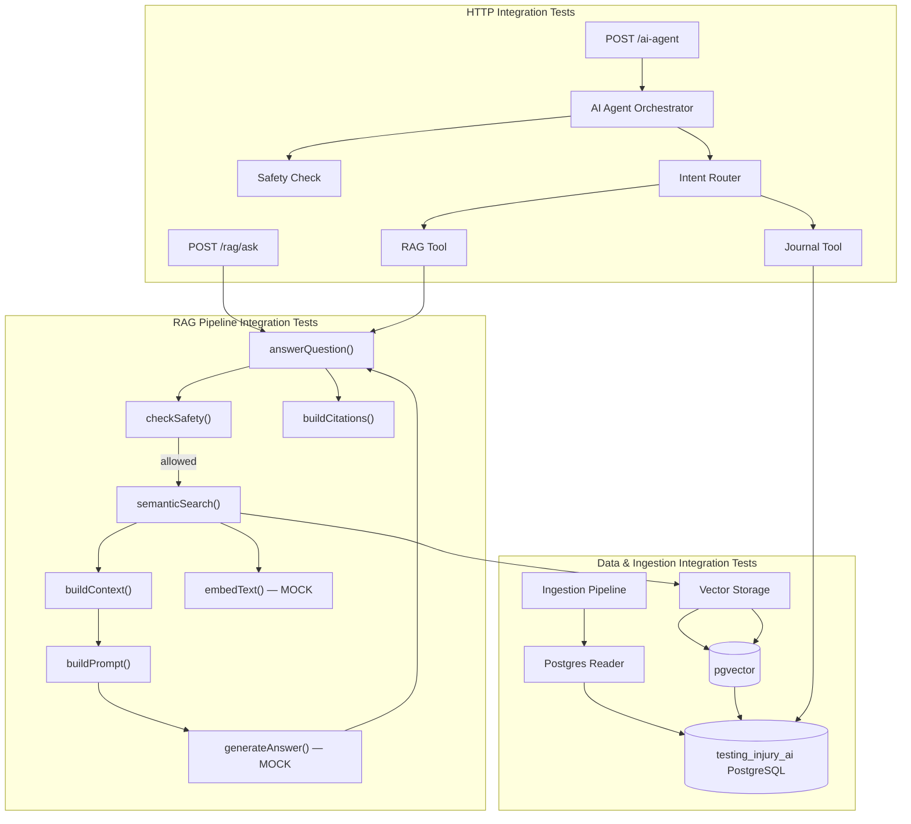
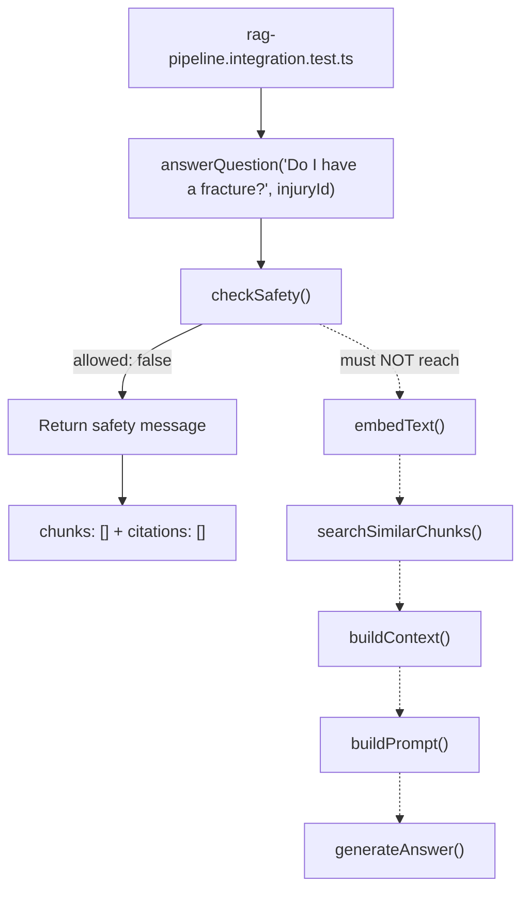

# Integration Test Plan

## Goal

Test the application progressively from:

**Data layer → RAG pipeline → HTTP routes → full AI agent behavior**

The principle is:

> Use real infrastructure and real application components where they matter, while mocking external AI services.

This means these integration tests verify **how our own components work together**, rather than testing the embedding model or LLM themselves.

---

## Test Architecture



---

# 1. Data Layer — Implemented

## PostgreSQL → Reader

**Test:** `reader.integration.test.ts`

```text
PostgreSQL
    ↓
readJournalData()
    ↓
Injury
Symptoms
Treatments
Medical Visits
Timeline Events
```

This verifies that the reader correctly retrieves journal data from the real test database.

---

# 2. Ingestion Pipeline — Implemented

**Test:** `ingestion-pipeline.integration.test.ts`

```text
PostgreSQL
    ↓
readJournalData()
    ↓
buildJournalDocuments()
    ↓
chunkDocuments()
```

This verifies that journal data can be transformed into documents and then into chunks suitable for embedding.

---

# 3. Vector Storage & Retrieval — Implemented

**Test:** `vector-storage.integration.test.ts`

```text
storeDocumentChunk()
        ↓
PostgreSQL + pgvector
        ↓
searchSimilarChunks()
        ↓
cosine similarity ordering
        ↓
injuryId filtering
        ↓
result limit
```

This verifies the actual vector-storage boundary using the real PostgreSQL database and real pgvector extension.

---

# 4. RAG Pipeline — Next

**Test:** `rag-pipeline.integration.test.ts`

The next integration boundary is:

```text
answerQuestion()
        │
        ├── checkSafety()          ← REAL
        │
        ├── semanticSearch()
        │       │
        │       ├── embedText()    ← MOCK
        │       │
        │       └── searchSimilarChunks()
        │               │
        │               └── REAL PostgreSQL + pgvector
        │
        ├── buildContext()         ← REAL
        │
        ├── buildPrompt()          ← REAL
        │
        ├── generateAnswer()       ← MOCK
        │
        └── buildCitations()       ← REAL
```

## What is being tested?

The integration test verifies that the RAG components work together correctly:

- Safety checks happen before retrieval.
- The question is embedded.
- Semantic search retrieves the correct evidence.
- Retrieval is restricted to the requested injury.
- Context is built from retrieved chunks.
- The prompt is constructed correctly.
- The generated answer is passed through the pipeline.
- Citations are generated from the retrieved evidence.

## What is mocked?

### `embedText()`

The integration test does **not** depend on the actual embedding model.

A deterministic test vector is provided:

```text
question
    ↓
mock embedText()
    ↓
[1, 0, 0]
```

The stored test chunks use known vectors so retrieval behavior is deterministic.

### `generateAnswer()`

The LLM is also mocked:

```text
RAG prompt
    ↓
mock generateAnswer()
    ↓
"mocked answer"
```

This prevents the integration test from depending on:

- Groq availability
- API keys
- Model behavior
- Network latency
- Response variability

## What remains real?

```text
Real checkSafety()
Real semanticSearch()
Real PostgreSQL
Real pgvector
Real similarity search
Real injury filtering
Real context construction
Real prompt construction
Real citation construction
```

The important boundary is:

> **Real application pipeline + real database/vector retrieval + mocked external AI services.**

---

# 5. RAG Safety Path

The RAG pipeline must also verify that safety-sensitive questions stop **before retrieval or LLM generation**.

Example:



The important assertions are:

```text
safety-sensitive question
        ↓
safety check
        ↓
return safe response

NO embedding
NO vector retrieval
NO LLM generation
NO citations
```

This verifies an important application-level safety boundary rather than merely testing `checkSafety()` in isolation.

---

# 6. HTTP RAG Route — After the Pipeline

Once the RAG pipeline integration tests pass, test the HTTP boundary:

```text
HTTP
 ↓
POST /rag/ask
 ↓
answerQuestion()
 ↓
RAG pipeline
 ↓
response
```

The route tests should verify:

- Valid requests return `200`.
- The question reaches the RAG pipeline.
- The requested injury is respected.
- The answer is returned.
- Chunks are returned.
- Citations are returned.
- Invalid requests return `400`.
- Safety-sensitive requests stop before retrieval/LLM generation.

The RAG pipeline itself remains tested separately.

---

# 7. AI Agent Route — Final Integration Layer

After the RAG HTTP boundary works, test the complete AI agent:

```text
HTTP
 ↓
POST /ai-agent
 ↓
AI Agent Orchestrator
 ↓
Safety Check
 ↓
Intent Router
 ├── RAG Tool
 │    ↓
 │    answerQuestion()
 │
 └── Journal Tool
      ↓
      PostgreSQL
```

The agent integration tests should verify that the orchestrator chooses the correct tool for different types of questions.

## RAG question

```text
"What treatments did I have?"
        ↓
AI Agent
        ↓
RAG intent
        ↓
RAG Tool
        ↓
answerQuestion()
        ↓
RAG pipeline
```

## Journal question

```text
"Show me my injury timeline"
        ↓
AI Agent
        ↓
Journal intent
        ↓
Journal Tool
        ↓
PostgreSQL
```

## Safety-sensitive question

```text
"Do I have a fracture?"
        ↓
AI Agent
        ↓
Safety Check
        ↓
safe response

NO RAG
NO JOURNAL
NO embedding
NO LLM
```

---

# Overall Testing Strategy

The integration test suite grows outward one boundary at a time:

```text
┌──────────────────────────────────────────┐
│          AI Agent HTTP Behavior          │
│                                          │
│   ┌──────────────────────────────────┐   │
│   │       HTTP RAG Route             │   │
│   │                                  │   │
│   │   ┌──────────────────────────┐   │   │
│   │   │      RAG Pipeline        │   │   │
│   │   │                          │   │   │
│   │   │  ┌────────────────────┐  │   │   │
│   │   │  │ Vector Retrieval   │  │   │   │
│   │   │  │                    │  │   │   │
│   │   │  │ PostgreSQL/pgvector│  │   │   │
│   │   │  └────────────────────┘  │   │   │
│   │   └──────────────────────────┘   │   │
│   └──────────────────────────────────┘   │
└──────────────────────────────────────────┘
```

## Current Status

| Layer               | Integration Test                         | Status         |
| ------------------- | ---------------------------------------- | -------------- |
| PostgreSQL Reader   | `reader.integration.test.ts`             | ✅ Implemented |
| Ingestion Pipeline  | `ingestion-pipeline.integration.test.ts` | ✅ Implemented |
| Vector Storage      | `vector-storage.integration.test.ts`     | ✅ Implemented |
| RAG Pipeline        | `rag-pipeline.integration.test.ts`       | 🔜 Next        |
| RAG HTTP Route      | `rag-route.integration.test.ts`          | 🔜 After RAG   |
| AI Agent HTTP Route | `ai-agent-route.integration.test.ts`     | 🔜 Final       |

---

# Testing Principle

The goal is **not** to test external AI providers inside these integration tests.

Instead:

```text
                    OUR CODE
                       │
        ┌──────────────┼──────────────┐
        ↓              ↓              ↓
   PostgreSQL      pgvector       RAG logic
      REAL            REAL            REAL
        │              │              │
        └──────────────┼──────────────┘
                       │
                External AI
                 ┌─────┴─────┐
                 ↓           ↓
            Embedding       LLM
              MOCK          MOCK
```

This gives us deterministic tests of the application's integration boundaries while keeping external model behavior out of the test suite.

Actual embedding-model and LLM evaluation belongs in **separate evaluation tests**, not these integration tests.
